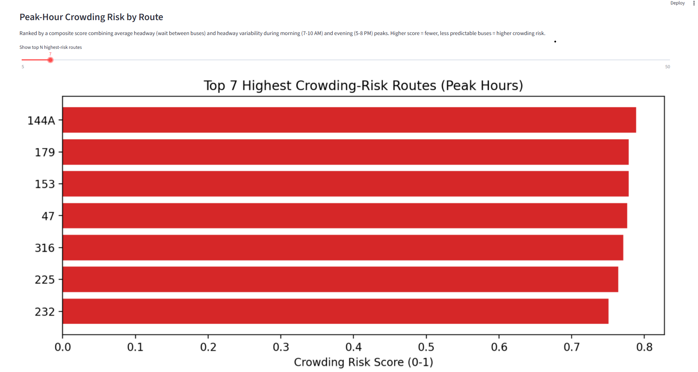
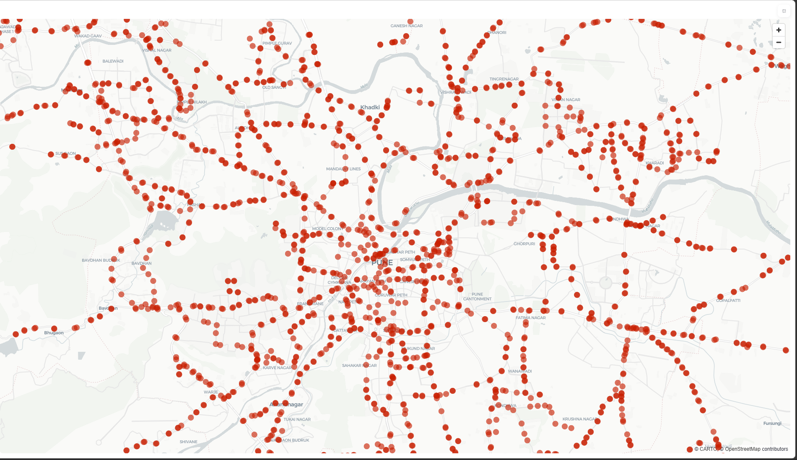
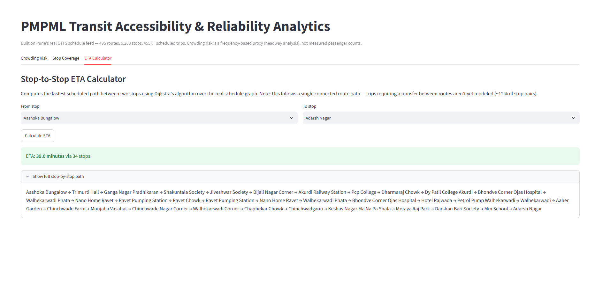
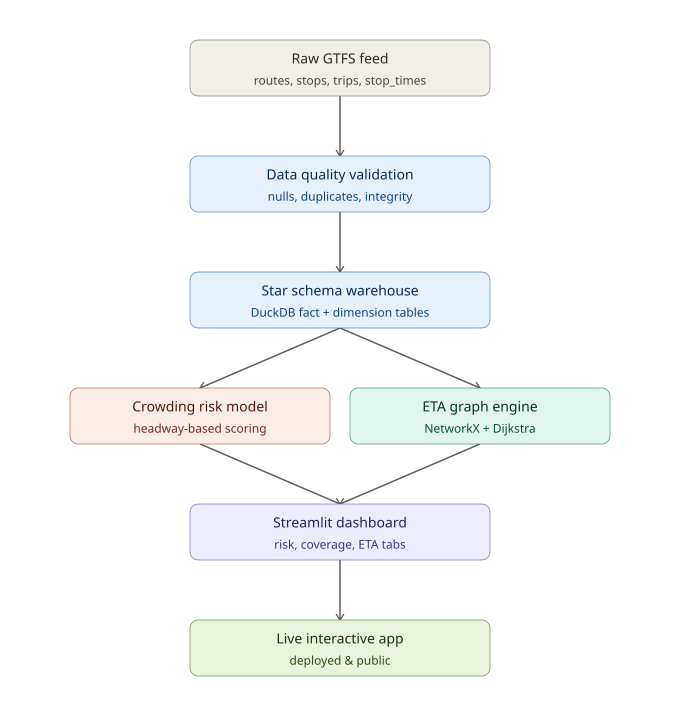
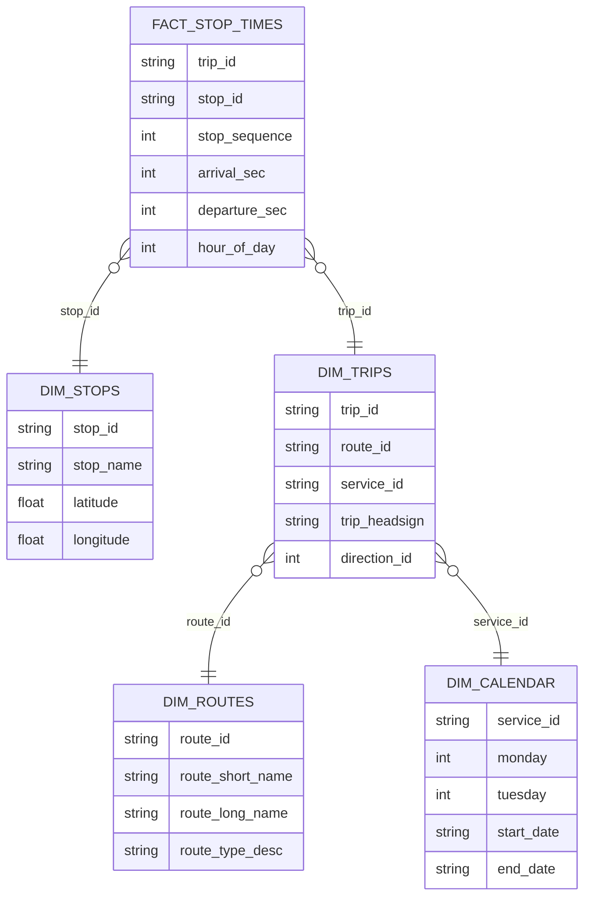
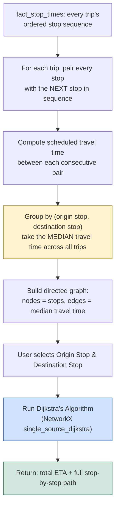

# 🚌 PMPML Transit Accessibility & Reliability Analytics

**An end-to-end data pipeline and interactive dashboard that turns Pune's public bus schedule data into actionable transit reliability insights.**

   

---

---

## Contents

- [Why I built this](#-why-i-built-this)
- [Key findings](#-key-findings)
- [Dashboard preview](#️-dashboard-preview)
- [System architecture](#️-system-architecture)
- [Data model — star schema](#️-data-model--star-schema)
- [How the ETA calculator works](#-how-the-eta-calculator-works)
- [How the crowding risk model works](#-how-the-crowding-risk-model-works)
- [Project structure](#-project-structure)
- [Tech stack](#-tech-stack--what-each-tool-is-doing)
- [Setup & run](#️-setup--run-locally)
- [Known limitations](#️-known-limitations-stated-deliberately-not-hidden)
- [Roadmap](#️-roadmap)
- [Data source](#-data-source)

---

## Why I built this

Public transit agencies almost never publish real-time occupancy or delay data — but *how often a bus actually runs* quietly tells you where a network is under strain. I wanted to answer three concrete questions for Pune's PMPML bus network using only its official published schedule:

1. **Which routes are most likely to be overcrowded during peak hours**, based on real service frequency?
2. **Where does the network's stop coverage thin out**, and where is it dense?
3. **How fast can a rider realistically get from any stop to any other stop**, based on the actual timetable?

This project is my end-to-end answer: a validated data warehouse, a custom reliability-risk model, a graph-based routing engine, and a live dashboard — built from raw schedule files up.

---

## Key Findings

| Metric | Result |
|---|---|
| Network scale analyzed | 495 routes · 6,203 stops · 10,728 trips · 455,820 stop-time records |
| Median peak-hour wait (network-wide) | **90.8 minutes** (7–10 AM & 5–8 PM combined) |
| Highest crowding-risk routes | Run only 2–3 trips *in total* during each peak window |
| ETA engine reachability | **88.3%** of random stop-pairs resolved via a single connected route |
| ETA engine query speed | **p95 ≈ 16 ms** per query, benchmarked over 300 random stop pairs |

*(Full ranked results: `data/processed/route_crowding_risk.csv`)*

---

## Dashboard Preview

**Crowding Risk tab** — routes ranked by peak-hour headway-based risk score:


(docs/images/crowd 2.png)

**Stop Coverage tab** — all 6,203 stops plotted by real GPS location, revealing PMPML's hub-and-spoke network structure radiating from central Pune:



**ETA Calculator tab** — pick any two stops, get the fastest scheduled path:



---

## System Architecture



Raw GTFS files are validated, loaded into a DuckDB star schema, then split into two parallel analysis stages — the headway-based crowding risk model and the NetworkX/Dijkstra ETA engine — both of which feed the Streamlit dashboard.

---

##  Data Model — Star Schema



**Why a star schema:** `fact_stop_times` holds every scheduled bus-stop event (455K+ rows), while the dimension tables hold descriptive context (stop names, route names, service calendar). This keeps the fact table lean and makes every analytical query — "trips per route," "stops per area," "headway per stop" — a simple join instead of a wide, repetitive flat table.

---

##  How the ETA Calculator Works

The ETA engine treats the entire bus network as a **directed graph** and finds the fastest scheduled path using **Dijkstra's algorithm** — the same core idea behind Google Maps routing.



**Design decisions worth noting:**
- **Median, not mean, travel time per edge** — a single unusually slow/fast scheduled trip won't skew the "typical" time the way an average would.
- **Directed graph, not undirected** — buses don't necessarily take symmetric routes in both directions, so A→B and B→A are modeled as separate edges.
- **Known limitation:** the graph only connects stops that share a *direct* trip. ~12% of random stop-pairs need a transfer between two different routes, which isn't modeled yet — a natural next iteration (see Roadmap).

---

##  How the Crowding Risk Model Works

PMPML doesn't publish real occupancy data, so this model uses a standard transit-analytics proxy: **headway** — the time gap between consecutive buses on the same route, at the same stop, during peak hours.

```
Long, inconsistent headway during peak hours  →  passengers wait longer & pile up  →  higher crowding risk
```

For every route, I compute:
- **Average peak-hour headway** — how long, on average, a rider waits
- **Headway variability (std dev)** — how *unpredictable* the wait is
- **Composite risk score** = `0.7 × normalized(avg headway) + 0.3 × normalized(headway variability)`

Weighted toward average wait time since that's the bigger driver of a rider's actual experience, with variability as a secondary signal.

---

##  Project Structure

```
├── data/
│   ├── raw/                      # Original GTFS feed (unmodified)
│   │   ├── agency.txt, routes.txt, stops.txt, trips.txt
│   │   ├── stop_times.txt, calendar.txt, shapes.txt, feed_info.txt
│   └── processed/                # Pipeline outputs
│       ├── dim_stops.csv, dim_routes.csv
│       ├── route_crowding_risk.csv
│       └── stop_graph_edges.csv, stop_graph_nodes.csv
├── src/
│   ├── 01_data_quality_check.py   # Null/duplicate/referential-integrity validation
│   ├── 02_build_star_schema.py    # DuckDB warehouse construction
│   ├── 03_crowding_analysis.py    # Headway-based risk scoring
│   └── 04_eta_engine.py           # Graph construction + Dijkstra ETA
├── dashboard/
│   └── app.py                     # Streamlit dashboard (3 tabs)
├── docs/images/                   # Screenshots used in this README
├── requirements.txt
└── README.md
```

---

##  Tech Stack & What Each Tool Is Doing

| Tool | Role in this project |
|---|---|
| **Python / Pandas** | Data cleaning, feature engineering, transformation logic |
| **DuckDB** | Embedded analytical database — star-schema warehouse, fast aggregation/joins over 455K+ rows without running a database server |
| **NetworkX** | Graph construction + Dijkstra's shortest-path algorithm for the ETA engine |
| **Streamlit** | Interactive dashboard — crowding risk explorer, coverage map, ETA calculator |
| **Matplotlib** | Static chart generation inside the dashboard |

---

##  Setup & Run Locally

```bash
git clone https://github.com/<your-username>/<repo-name>.git
cd <repo-name>

python -m venv venv
venv\Scripts\activate        
pip install -r requirements.txt

# Run the pipeline stages in order
python src/01_data_quality_check.py
python src/02_build_star_schema.py
python src/03_crowding_analysis.py
python src/04_eta_engine.py

# Launch the dashboard
streamlit run dashboard/app.py
```

**Live demo:** _add your deployed Streamlit Cloud link here once deployed_

---

## Known Limitations (stated deliberately, not hidden)

- `calendar.txt` defines a single `WEEKDAY` service — this feed doesn't distinguish weekend schedules.
- This is **scheduled**, not observed, data. "Crowding risk" is a frequency-based proxy, not a measured passenger count, and "ETA" reflects the *scheduled* timetable, not live traffic conditions.
- The ETA graph currently models only direct, single-route paths — about 12% of random stop pairs would require a transfer between two routes, which isn't modeled yet.

I'd rather state these plainly than have the numbers misread as more precise than they are.

---

## Roadmap

- [x] Data acquisition + automated quality validation
- [x] Star-schema warehouse (DuckDB)
- [x] Headway-based crowding risk model
- [x] Graph-based ETA engine (NetworkX/Dijkstra)
- [x] Interactive Streamlit dashboard
- [ ] Multi-route transfer modeling for the remaining ~12% of stop pairs
- [ ] Validate crowding-risk signal against real ridership data, if it becomes available
- [ ] Deploy live demo on Streamlit Community Cloud

---

## Data Source

Schedule data sourced from PMPML's official GTFS feed via the open-source [`croyla/pmpml-gtfs`](https://github.com/croyla/pmpml-gtfs) project, which builds a standards-compliant [GTFS](https://gtfs.org/) feed from PMPML's public transit API. All data modeling, analysis, algorithms, and the dashboard in this repository are original work built on top of that raw feed.
# PMPL-Bus-Transit-Analytics-Project

